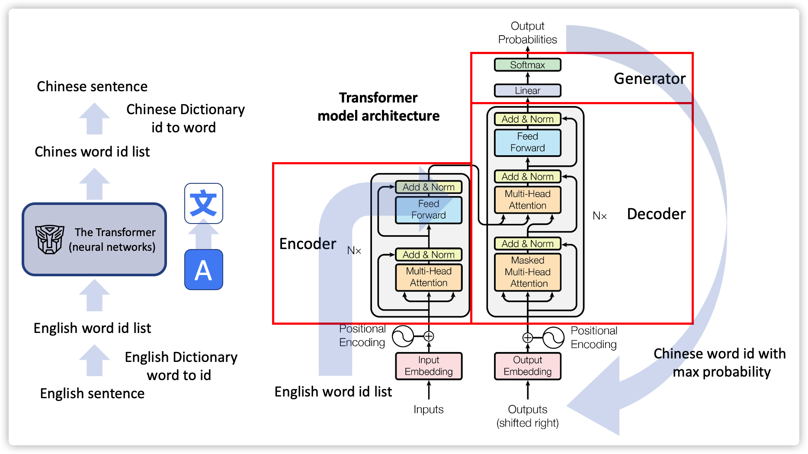

# Annotated-Transformer-English-to-Chinese-Translator

The Transformer from “Attention is All You Need” has been on a lot of people’s minds since 2017.

In this repo, I present an "annotated" version of the Transformer Paper in the form of a line-by-line implementation to build an English-to-Chinese translator with PyTorth deep learning framework.

Visit my blog for details and more background: https://cuicaihao.com/the-annotated-transformer-english-to-chinese-translator/



Check the jupyter notebook for details of the programming.
[Annotated_Transformer_English_to_Chinese_Translator](Annotated_Transformer_English_to_Chinese_Translator.ipynb)

## Python Environment (Miniconda)

- Python=3.7.8
- pytorch=1.4.0 ( install cuda verion if you have a CUDA Graph Card)
- nltk=3.5
- numpy=1.19.0
- matplotlib=3.3.1

To try the code, run the following command in your terminal or cmd window:

```python
python Annotated_Transformer_English_to_Chinese_Translator.py
```

## Reference

- The Annotated Transformer http://nlp.seas.harvard.edu/2018/04/03/attention.html
- The Illustrated Transformer http://jalammar.github.io/illustrated-transformer/
- GreedAI NLP Trainig Camp: https://www.greedyai.com/

MIT License

Copyright (c) 2020 Chris Cui
